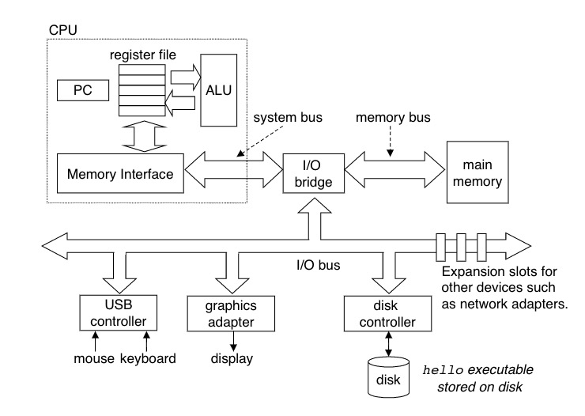

## Introduction

A computer system is a collection of hardware and software components that work together to run computer programs.

text files (ASCII)
binary files

The compilation system
(hello.c) preprocessor → (hello.i) compiler → (hello.s) assembler → (hello.o) linker (hello)

buses

I/O devices

main memory

processer

memory hierarchy
L0: regisrer
L1: on-chip L1 cache (SRAM)
L2: off-chip L2 cache (SRAM)
L3: main memory (SRAM)
L4: local secondary storage
L5: remote secondary storage

The opeartiing system has two primary purpose: (1) to protect the hardware from misuse by runaway applications, and (2) To provide applications with simple and uniform mechanisms for manipulating complicated and often wildly different low-level hardware devices.

process
context switch
context, includes information such as the current values of the PC, the register file, and the contents of main memory.

thread
running in the context of the process and sharing the same code and global data.
